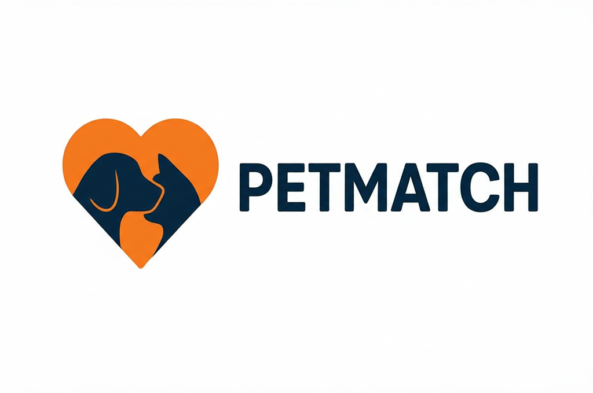

# PetMatch - Sistema de Adoção de Animais

Um sistema web completo para facilitar a adoção de animais e ajudar na busca por pets perdidos, desenvolvido com Python e Dash.



## 📋 Sobre o Projeto

O PetMatch é uma plataforma que conecta pessoas interessadas em adotar animais com responsáveis que desejam encontrar um lar amoroso para seus pets. Além disso, o sistema também oferece funcionalidades para cadastro e busca de animais perdidos.

### ✨ Funcionalidades Principais

- **👤 Sistema de Usuários**
  - Cadastro e login de usuários
  - Perfil personalizado
  - Edição de informações pessoais
  - Preferências de adoção

- **🐕 Gestão de Pets para Adoção**
  - Cadastro de pets disponíveis para adoção
  - Busca avançada com filtros
  - Visualização detalhada dos animais
  - Gerenciamento dos próprios pets cadastrados

- **🔍 Pets Perdidos**
  - Cadastro de animais perdidos
  - Busca por pets perdidos na região
  - Edição de informações de pets perdidos


## 🛠️ Tecnologias Utilizadas

- **Python 3.x** - Linguagem principal
- **Dash** - Framework web para Python
- **Dash Bootstrap Components** - Componentes de UI
- **SQLite** - Banco de dados
- **bcrypt** - Criptografia de senhas
- **HTML/CSS** - Interface e estilização

## 📁 Estrutura do Projeto

```
adocaoDeAnimais/
├── app.py                 # Arquivo principal da aplicação
├── callbacks.py           # Callbacks do Dash
├── db_conexao.py         # Conexão com banco de dados
├── requirements.txt      # Dependências do projeto
├── assets/              # Recursos estáticos
│   ├── imagens/        # Imagens dos pets
│   ├── logo.png        # Logo do sistema
│   ├── fundopetmatch.png
│   └── style.css       # Estilos customizados
├── database/           # Banco de dados SQLite
│   └── petmatch.db
└── pages/             # Páginas da aplicação
    ├── principais/    # Telas principais (login, menu)
    ├── pet/          # Gestão de pets para adoção
    ├── perdido/      # Gestão de pets perdidos
    └── usuario/      # Gestão de usuários
```

## 🚀 Como Executar

### Pré-requisitos

- Python 3.7 ou superior
- pip (gerenciador de pacotes Python)

### Instalação

1. **Clone o repositório**
   ```bash
   git clone https://github.com/lucaschavessf/adocaoDeAnimais.git
   cd adocaoDeAnimais
   ```

2. **Crie um ambiente virtual (recomendado)**
   ```bash
   python -m venv .venv
   .venv\Scripts\activate  # Windows
   # ou
   source .venv/bin/activate  # Linux/Mac
   ```

3. **Instale as dependências**
   ```bash
   pip install -r requirements.txt
   ```

4. **Execute a aplicação**
   ```bash
   python app.py
   ```

5. **Acesse no navegador**
   ```
   http://localhost:8050
   ```

## 📊 Banco de Dados

O sistema utiliza SQLite com as seguintes tabelas principais:

- **login_usuarios** - Credenciais de acesso
- **usuarios** - Informações dos usuários
- **pets** - Dados dos pets para adoção
- **perdidos** - Informações de pets perdidos
- **preferencias** - Preferências de adoção dos usuários

O banco é criado automaticamente na primeira execução.

## 🎨 Interface

O sistema possui uma interface moderna com:

- ✅ Cards informativos para cada pet
- ✅ Formulários intuitivos
- ✅ Navegação simplificada
- ✅ Feedback visual para ações do usuário

### Banco de Dados

O sistema cria automaticamente o banco SQLite na pasta `database/`. Para reset completo, basta deletar o arquivo `petmatch.db`.

## 👨‍💻 Equipe do Projeto

- **[Allysson Fellype](https://www.linkedin.com/in/allysson-fellype-868390249/)** 🔗
- **[Lucas Chaves](https://www.linkedin.com/in/lucaschavesf/)** 🔗
- **[Matheus Andrade](https://www.linkedin.com/in/matheus-andrade-silva1/)** 🔗
- **[Eulália Albuquerque](https://www.linkedin.com/in/eulalialbuquerque/)** 🔗
- **[Fernando Marinho](https://www.linkedin.com/in/fernando-marinho-05589335a/?originalSubdomain=br)** 🔗

---

## 📸 Screenshots

### Tela Principal


### Busca de Pets


### Cadastro de Pet


### Perfil do Usuário


---

